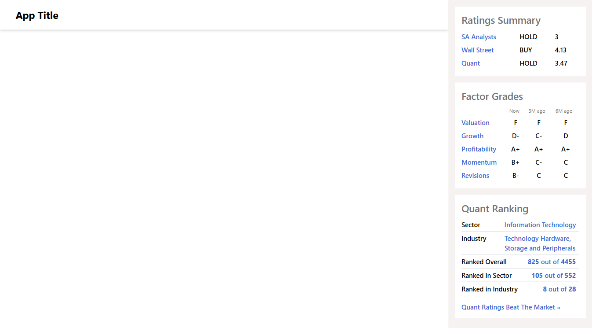

# 💳 Financial Card — React + TypeScript + Vite

A modern, performant financial card component with premium user features, optimized loading states, and comprehensive test coverage.



## 🔗 Live Demo

https://vladp456.github.io/financial-card/

---

## ✨ Features

- 💰 **Financial Ratings Display** — SA Analysts, Wall Street, and Quant ratings
- 📊 **Factor Grades** — Real-time factor analysis (Now, 3M, 6M)
- 🏆 **Quant Ranking** — Sector and industry-specific rankings
- 🔒 **Premium User Features** — Content visibility based on user subscription
- ⚡ **Optimized Loading** — Progressive rendering without layout shifts
- 🎯 **Type-Safe** — Full TypeScript coverage
- ✅ **Well Tested** — Comprehensive unit tests with Vitest
- 📱 **Fully Responsive** — Works seamlessly on all devices

---

## 🛠️ Tech Stack

### **Core**

- [React 19](https://react.dev/) — UI library
- [TypeScript 5.9](https://www.typescriptlang.org/) — Type safety
- [Vite 7](https://vite.dev/) — Build tool & dev server

### **Data Management**

- [TanStack Query 5](https://tanstack.com/query) — Async state management & caching
- Custom hooks for data fetching and normalization

### **UI & Styling**

- [Tailwind CSS 4](https://tailwindcss.com/) — Utility-first CSS
- [Lucide React](https://lucide.dev/) — Beautiful icons

### **Testing**

- [Vitest 4](https://vitest.dev/) — Fast unit test framework
- [Testing Library](https://testing-library.com/) — React component testing
- [jsdom](https://github.com/jsdom/jsdom) — DOM environment for tests

### **Developer Tools**

- ESLint 9 + TypeScript ESLint — Code linting
- Type-safe API layer with TypeScript

---

## 🚀 Getting Started

### Prerequisites

- Node.js 18+
- npm, yarn, or pnpm

### Installation

1. **Clone the repository**

```bash
git clone https://github.com/vladp456/financial-card.git
cd financial-card
```

2. **Install dependencies**

```bash
npm install
```

3. **Start development server**

```bash
npm run dev
```

4. **Open your browser**

```
http://localhost:5173
```

### Running Tests

```bash
npm run test
```

### Build for Production

```bash
npm run build
```

---

## 📂 Project Structure

```
src/
├── api/                     # API layer
│   ├── factorGrades.ts
│   ├── quantRanking.ts
│   ├── ratings.ts
│   └── user.ts
├── components/              # React components
│   ├── shared/              # Shared/reusable components
│   ├── ErrorBoundary.tsx
│   ├── FactorGrades.tsx
│   ├── QuantRanking.tsx
│   ├── QuantRankingTableRow.tsx
│   ├── RatingsSummary.tsx
│   └── RightRail.tsx
├── constants/               # App constants
│   └── api.ts
├── hooks/                   # Custom React Query hooks
│   ├── useFactorGradesQuery.ts
│   ├── useFactorGradesNowQuery.ts
│   ├── useFactorGrades3MQuery.ts
│   ├── useFactorGrades6MQuery.ts
│   ├── useQuantRankingQuery.ts
│   ├── useRatingsSummaryQuery.ts
│   └── useUserQuery.ts
├── tests/                   # Test files
│   ├── normalizeFactorGrades.test.ts
│   ├── useFactorGrades3MQuery.test.tsx
│   ├── useFactorGrades6MQuery.test.tsx
│   ├── useFactorGradesNowQuery.test.tsx
│   ├── useFactorGradesQuery.test.tsx
│   ├── useQuantRankingQuery.test.tsx
│   ├── useRatingsSummaryQuery.test.tsx
│   ├── useUserQuery.test.tsx
│   └── setup.ts             # Test setup & configuration
├── types/                   # TypeScript type definitions
│   ├── factorGrades.ts
│   ├── quantRanking.ts
│   ├── rating.ts
│   └── user.ts
├── utils/                   # Utility functions
│   └── normalizeFactorGrades.ts
├── App.tsx                  # Main app component
├── main.tsx                 # Entry point
└── index.css                # Global styles
```

---

## 🎯 Key Features Explained

### **Premium User Access Control**

Only premium users can access certain cards. Non-premium users see only the Quant Ranking card.

```typescript
export const useUserQuery = () => {
  return useQuery<User>({
    queryKey: ['user'],
    queryFn: getUser,
    staleTime: Infinity
  })
}

const { data: user } = useUserQuery()
const isPremiumUser = user?.premium ?? false
```

### **Progressive Data Loading**

Cards render as soon as their data is available, preventing layout shifts:

```typescript
const { data: ratingsData, isLoading: ratingsLoading } =
  useRatingsSummaryQuery(isPremiumUser)
const { data: factorGrades, isLoading: gradesLoading } =
  useFactorGradesQuery(isPremiumUser)
const { data: rankingData, isLoading: rankingLoading } = useQuantRankingQuery()
```

### **Data Normalization**

Factor grades from different time periods are normalized to a consistent format:

```typescript
normalizeNow(data)
normalize3M(data)
normalize6M(data)
```

### **Optimized Query Configuration**

Different refetch strategies based on data volatility:

- **Now data**: Refetches every 5 seconds
- **3M data**: Refetches every 3 minutes
- **6M data**: Refetches every 6 minutes
- **User/Ranking**: Infinite stale time (rarely changes)

---

## 🧪 Testing

The project includes comprehensive unit tests covering:

- ✅ **Normalization functions** — Data transformation utilities
- ✅ **React Query hooks** — All custom hooks
- ✅ **Access control** — Premium user permissions
- ✅ **Error handling** — Error states and edge cases
- ✅ **Loading states** — Progressive rendering

Run tests with:

```bash
npm run test
```

Test coverage includes:

- `normalizeFactorGrades.test.ts` — Utility function tests
- `useUserQuery.test.tsx` — User authentication
- `useRatingsSummaryQuery.test.tsx` — Ratings data fetching
- `useQuantRankingQuery.test.tsx` — Ranking data fetching
- `useFactorGradesQuery.test.tsx` — Aggregated factor grades
- `useFactorGradesNowQuery.test.tsx` — Current factor grades
- `useFactorGrades3MQuery.test.tsx` — 3-month factor grades
- `useFactorGrades6MQuery.test.tsx` — 6-month factor grades

---

## 🎨 Component Architecture

### **Card Rendering Order**

1. **Ratings Summary** (Premium only)
2. **Factor Grades** (Premium only)
3. **Quant Ranking** (All users)

### **Component Hierarchy**

```
App
└── RightRail
    ├── RatingsSummary (Premium)
    ├── FactorGrades (Premium)
    └── QuantRanking
        └── QuantRankingTableRow
```

### **Responsive Design**

- Mobile-first approach with Tailwind CSS
- Cards stack vertically on mobile
- Optimized spacing and typography for all screen sizes

---

## 🔧 Configuration

### TypeScript

Strict mode enabled with modern ES2022 target:

```json
{
  "strict": true,
  "target": "ES2022",
  "moduleResolution": "bundler",
  "types": ["vitest/globals", "vite/client", "node"]
}
```

### Vite

Configured with React plugin and Tailwind CSS:

```typescript
export default defineConfig({
  plugins: [react(), tailwindcss()],
  test: {
    environment: 'jsdom',
    globals: true,
    setupFiles: './src/tests/setup.ts'
  }
})
```

---

## 📦 Build Output

The production build is optimized with:

- Code splitting for better performance
- Tree shaking to eliminate unused code
- Minification and compression
- Chunked vendor dependencies

```bash
npm run build
npm run preview
```

---
